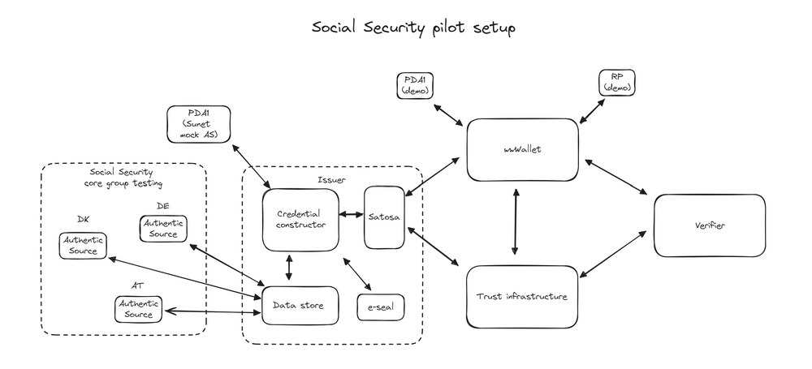

# Interoperability Lab Overview

## Purpose

The DC4EU Interoperability Lab serves as a testing and validation environment
for integrating and interacting with the components of the EU Digital Identity
Wallet (EUDI Wallet) ecosystem. It enables stakeholders to explore
interoperability between entities, ensuring cross-border credential issuance,
management, and validation.

The lab’s primary goal is to validate compliance with international standards,
including OpenID Federation, OpenID4VCI, and OpenID4VP, and to facilitate
real-world use cases in the education and social security domains.

## Scope

The Interoperability Lab focuses on the following:

1. **Technical Interoperability**:
   - Testing API compatibility and federation node functionality.
   - Validating credential issuance, presentation, and trust workflows.
2. **Semantic Interoperability**:
   - Ensuring data schemas and formats comply with defined standards.
3. **Organizational Interoperability**:
   - Exploring governance and trust models, including delegation and accreditation.

The lab emphasizes piloting use cases such as:

- **EHIC Credential**: European Health Insurance Card credentials.
- **PDA1 Credential**: Social security credentials.

## Core Components

The lab comprises the following entities:

### Authentic Sources

The **Authentic Source** refers to an organization and the verified data it
manages, which can be used to create credentials for issuance to a wallet, such
as a (Q)EAA or PID credential.

In the social security use case, DC4EU will pilot workflows for issuing,
storing, requesting, receiving, and verifying PDA1 and EHIC credentials within
the wallet ecosystem.

The Authentic Source can interact with the Issuer in two ways, which are
detailed in the **Integrate Authentic Source with Issuer** section.

### Issuers

The **Issuer** is responsible for creating and issuing credentials to wallets
and integrates with the Authentic Source, Holder Wallet, and Trust
Infrastructure to enable this process.

The interface between the Issuer and the Authentic Source is a REST API, with
its specification available in the DC4EU GitHub repository. The Interoperability
Lab will investigate potential adjustments for credential types such as EAA,
PuB-EAA, and QEAA.

Credential issuance to holder wallets is based on **OpenID4VCI**, a standard
framework defined in the ARF. The flexibility of OpenID4VCI allows for varied
implementations, which can create interoperability challenges. DC4EU defines its
implementation and collaborates with stakeholders to align approaches to achieve
interoperability.

The interface between the Issuer and the Trust Infrastructure ensures that
issued credentials are trusted within the federation, with the specifics
depending on the trust framework in use.

### Holders

The **Holder**, often referred to as a wallet, is a component responsible for
managing credentials. Wallets can vary significantly in their technical
implementation, functionality, and end-user requirements. End-users may be
natural persons or organizational entities, each with distinct usage patterns
and functional needs.

Wallets enable the secure storage, issuance, and presentation of credentials.
They interact with Credential Issuers during issuance and with Verifiers during
credential presentation. While implementations differ, all wallets must ensure
security, user control, and interoperability with the federation.

The variety of wallet implementations reflects the diverse needs of users and
contexts, including mobile, web-based, and hybrid approaches. These variations
impact how credentials are stored, keys are managed, and interactions with the
trust infrastructure are facilitated. Regardless of the specific type, all
wallets must align with federation standards and protocols, such as OpenID4VCI
and OpenID4VP, to ensure seamless interoperability.

### Verifiers

The **Verifier** is a software component used by a relying party to validate the
integrity of credentials and the trustworthiness of their providers. It
communicates with the wallet using **OpenID4VP**, ensuring secure credential
presentation. Through a REST API, the verifier allows relying parties to verify
credentials, extract information, and process data.

The verifier integrates with the federation's trust infrastructure to validate
the trust relationships and confirm the wallet instance's validity. It must also
understand the credential's schema, either by lookup or pre-configured
knowledge, to interpret the information contained within the credential. While
its interfaces are similar to those of an Issuer, the verifier focuses on
credential validation rather than issuance.

### Technical Trust Model

The **Trust Infrastructure** relies on dynamic metadata exchange and trust
chains. Each entity publishes its metadata, which includes information such as
roles, cryptographic keys, and trust relationships. Other entities dynamically
retrieve and validate this metadata as part of the trust establishment process.

Entities, such as Credential Issuers, Verifiers, and Wallet Providers, are
authenticated through the federation, which uses cryptographic signatures, trust
hierarchies, and policy enforcement to ensure their legitimacy. This
decentralized approach enables scalable and flexible trust relationships without
requiring a centralized entity registry.

The DC4EU Interoperability Lab tests the robustness of this dynamic trust model
by validating metadata retrieval, trust chain resolution, and cryptographic
signature verification to ensure interoperability across the ecosystem.

## Participation Models

The lab supports three participation models:

1. **Piloting agents using DC4EU infrastructure**  
   Participants can use pre-configured DC4EU components to test wallet flows and
   credential issuance end-to-end.

2. **Piloting agents integrating their own components**  
   Stakeholders can integrate their own systems (such as authentic sources or
   credential issuers) with the DC4EU trust infrastructure to evaluate
   interoperability.

3. **Stakeholder interoperability testing**  
   Developers and organizations can validate custom wallets, verifiers, or other
   components against the federation and the trust setup used in the lab.

## Interoperability Lab Overview

The diagram illustrates how data flows through the ecosystem:

- Authentic Sources provide verified data to the Credential Constructor,
  which assembles credentials.
- SATOSA acts as a gateway between the Credential Constructor and the
  Wallet, ensuring the secure delivery of credentials.
- Wallets store credentials and present them to relying parties. Verifiers
  validate the credentials by interacting with the Trust Infrastructure to
  ensure trust and credential integrity.

## Trust Infrastructure

The trust infrastructure in the pilot setup dynamically supports trust
validation across entities. As shown in the diagram, it acts as a foundational
layer enabling Verifiers, Wallets, and other stakeholders to establish mutual
trust. The infrastructure ensures:

1. The authenticity of credentials issued by the Issuer.
2. Secure and compliant interactions between wallets and Verifiers.
3. Dynamic trust relationships, enable entities to adapt to changes in
   policies and requirements.

## Workflows and Outcomes

The DC4EU Pilot demonstrates how the wallet ecosystem operates, with key
workflows encompassing credential issuance, credential presentation, and trust
validation. These workflows are critical to ensuring interaction between
ecosystem components such as Authentic Sources, Credential Issuers, Wallets, and
Verifiers.

### Credential Issuance

The workflow begins with data provided by Authentic Sources, which represent
national or domain-specific authorities. This data is processed by the
Credential Constructor, validated, and digitally sealed using the e-seal before
being issued to wallets via the SATOSA framework. The integration of multiple
Authentic Sources ensures that credentials like EHIC or PDA1 are constructed
using, trusted datasets.

### Credential Presentation

Wallets serve as tools for Holders to present their credentials to relying
parties, such as Verifiers. During the credential presentation, the Wallet
securely communicates with the Verifier to share a digitally signed credential.
The Verifier validates the credential's integrity and ensures it complies with
the relevant policies and standards required by the ecosystem.

### Trust Validation

Trust relationships are maintained through the Trust Infrastructure, which
dynamically validates entity metadata and credentials during interactions.
Verifiers and wallets rely on the Trust Infrastructure to authenticate entities
and confirm credential integrity.
