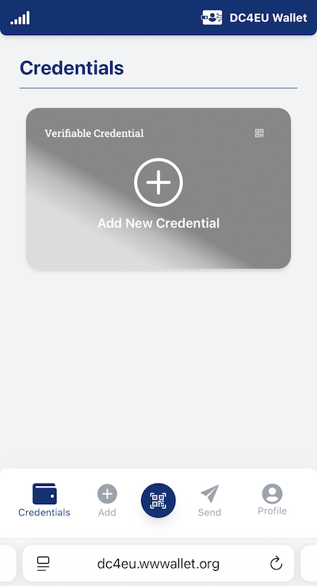
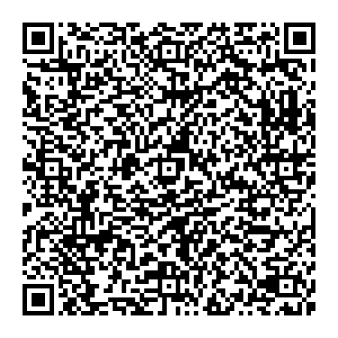
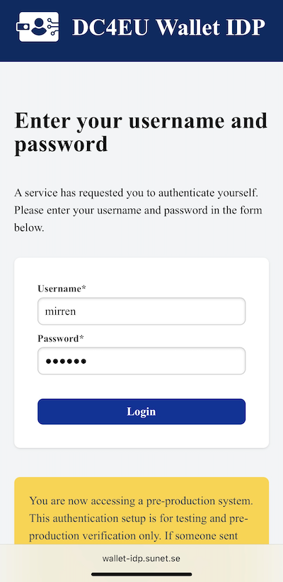
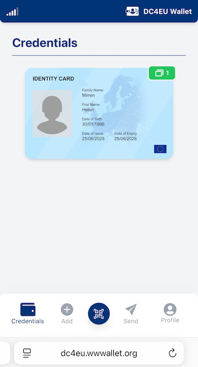
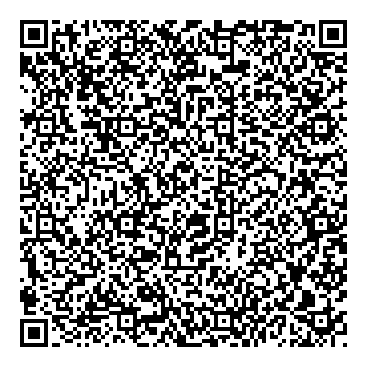
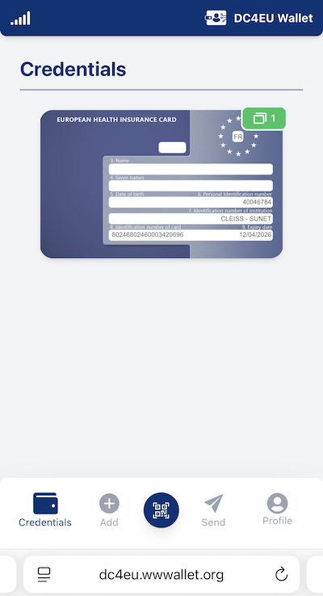
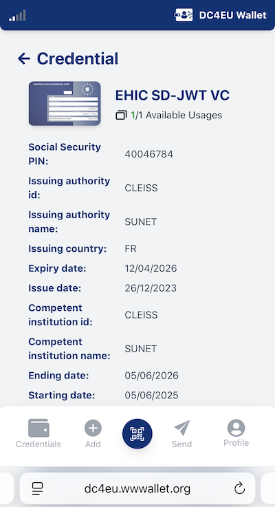

# DC4EU wwWallet Quick User Guide

This guide will help you get started with the DC4EU demo of the wwWallet, available at [https://dc4eu.wwwallet.org](https://dc4eu.wwwallet.org). You'll learn how to set up the wallet, manage your digital credentials, and present them when needed.

---

## Table of Contents
- [DC4EU wwWallet Quick User Guide](#dc4eu-wwwallet-quick-user-guide)
  - [Table of Contents](#table-of-contents)
  - [Prerequisites](#prerequisites)
  - [Related Resources](#related-resources)
  - [Getting Started](#getting-started)
    - [Step 1: Set Up the wwWallet](#step-1-set-up-the-wwwallet)
    - [Step 2: Sign Up with a Passkey](#step-2-sign-up-with-a-passkey)
    - [Step 3: Sign In Using Your Passkey](#step-3-sign-in-using-your-passkey)
    - [Step 4: Welcome Tour](#step-4-welcome-tour)
  - [How to Add Verifiable Credentials to Your DC4EU wwWallet](#how-to-add-verifiable-credentials-to-your-dc4eu-wwwallet)
  - [Obtaining a PID (Personal Identifier)](#obtaining-a-pid-personal-identifier)
    - [Option 1: Using a Web Browser](#option-1-using-a-web-browser)
    - [Option 2: Using a Smartphone](#option-2-using-a-smartphone)
  - [Obtaining an EHIC Verifiable Credential](#obtaining-an-ehic-verifiable-credential)
    - [Option 1: Using a Web Browser](#option-1-using-a-web-browser-1)
    - [Option 2: Using a Smartphone](#option-2-using-a-smartphone-1)
  - [Verifying and Presenting Credentials](#verifying-and-presenting-credentials)
    - [Verifier Demo Flow](#verifier-demo-flow)

---

## Prerequisites

The wwWallet frontend is compatible with the PRF extension to WebAuthn. To ensure the best user experience, your operating system and web browser must support this extension. For details on compatibility, visit: [PRF compatibility - Wallet Frontend on GitHub](https://github.com/wwWallet/wallet-frontend?tab=readme-ov-file#prf-compatibility-scenarios-support-by-operating-system-and-latest-browser-versions)

While wwWallet is web-based, it can also be installed as a Progressive Web App (PWA). This guide focuses on using the wallet directly from a browser on your computer or smartphone.

## Related Resources

A YouTube video demonstrating the usage of an earlier version of the DC4EU wwWallet is available here: [DC4EU Wallet Demonstration](https://www.youtube.com/watch?v=gnDeTEmWdok)

## Getting Started

### Step 1: Set Up the wwWallet

To be able to use your wwWallet you first need to activate the wallet on the device that you intend to use it on.

1. Open [https://dc4eu.wwwallet.org](https://dc4eu.wwwallet.org) in your browser.
2. You will be prompted to log in with an existing passkey or sign up as a new user and create a new passkey.

- **New users**: Click **Sign Up** and enter your name.
- **Returning users**: Select an existing passkey to log in.

### Step 2: Sign Up with a Passkey

Enter your username and click **Sign up with passkey**.

You will now create a passkey and authenticate using your device’s built-in method (e.g., Touch ID or Face ID on Apple devices). On macOS or iOS, passkeys are stored in the Passwords app.

### Step 3: Sign In Using Your Passkey

### Step 4: Welcome Tour

The first time you access wwWallet, a short tour of the menus is offered.

Click through the tour to learn about the wallet interface.

Once logged in, your wallet will initially be empty:

---

## How to Add Verifiable Credentials to Your DC4EU wwWallet

To begin using your wwWallet, you’ll need to add Verifiable Credentials (VCs) from an authorized issuer. This process requires a special pick-up code — a unique identifier provided to you by your competent institution.

There are two ways to retrieve credentials:

1. Click a link containing the pick-up code in your browser.
2. Scan a QR code using the wwWallet on your smartphone.

## Obtaining a PID (Personal Identifier)

The first credential to add is the PID (Personal Identifier), issued by a trusted PID Provider. In this demo, it is issued by a SATOSA-based issuer hosted by SUNET.

### Option 1: Using a Web Browser

- Open the [Sunet DEMO PID issuer URL][PID-Credential-Offer].

### Option 2: Using a Smartphone

- Log in to your wwWallet.
- Tap the blue QR-code icon to open your camera:

- Scan the PID QR code:

Authenticate with:

- **Username**: `mirren`
- **Password**: `mirren`

The PID is added to your wallet:

## Obtaining an EHIC Verifiable Credential

Obtaining an EHIC credential follows the same process as obtaining the PID.

### Option 1: Using a Web Browser

- Open the [Sunet DEMO EHIC credential offer URL][EHIC-Credential-Offer].

### Option 2: Using a Smartphone

- Scan the EHIC QR code with your wwWallet:

Authenticate using:
- **Username**: `mirren`
- **Password**: `mirren`

An EHIC Verifiable Credential will be added to your wallet:

Tap the EHIC card to view details:

## Verifying and Presenting Credentials

A Relying Party or Service Provider acting as a Verifier can request the user to present an attestation implemented as Verifiable Credentials in the wwWallet. For the DC4EU wwWallet Demo purposes a proof-of-concept verifier webpage has been developed: [DC4EU Verifier](https://dc4eu-verifier.wwwallet.org)

### Verifier Demo Flow

1. Click **Verify Credential** on the DC4EU Verifier start page.

2. Select **European Health Insurance Card (EHIC)** Verifiable Credentials (VCs) to present to the Service Provider.

3. Configure the fields to present, select a purpose, then click **Request**.

4. The Verifier now presents a request for the user to present their credentials. Open the wwWallet on your smartphone and scan the QR-code shown on the Verifier webpage — **not** the one in this screenshot — to start the verification process.

5. Review the credential request and click **Next**.

6. Select the EHIC credential and click **Next**.

7. Review the summary and click **Send**.

8. wwWallet in your Smartphone will show **Verification Succeeded**.

9. Success! The DC4EU Verifier now presents the requested claims extracted from the verifiable credentials.

---

[EHIC-Credential-Offer]: https://dc4eu.wwwallet.org/cb?credential_offer=%7B%0A%20%20%22credential_issuer%22%3A%20%22https%3A%2F%2Fsatosa-test-1.sunet.se%22%2C%0A%20%20%22credential_configuration_ids%22%3A%20%5B%22urn%3Aeudi%3Aehic%3A1%22%5D%2C%0A%20%20%22grants%22%3A%20%7B%0A%20%20%20%20%22authorization_code%22%3A%20%7B%0A%20%20%20%20%20%20%22issuer_state%22%3A%20%22collect_id%3Dcollect_id_ehic_100%26authentic_source%3DEHIC%3A00001%22%0A%20%20%20%20%7D%0A%20%20%7D%0A%7D%0A
[PID-Credential-Offer]: https://dc4eu.wwwallet.org/cb?credential_offer=%7B%22credential_issuer%22%3A%22https%3A%2F%2Fsatosa-test-1.sunet.se%22%2C%22credential_configuration_ids%22%3A%5B%22PersonIdentificationData%22%5D%2C%22grants%22%3A%7B%22authorization_code%22%3A%7B%7D%7D%7D
